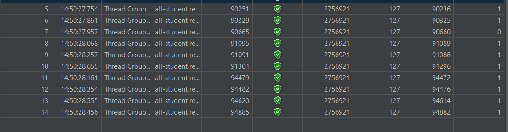
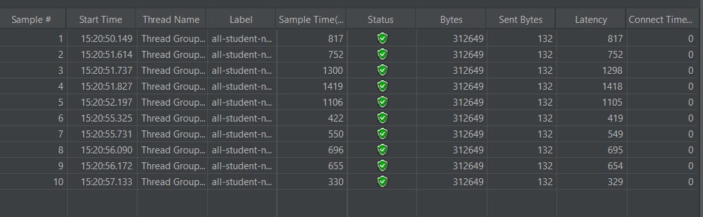
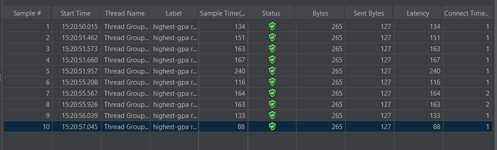
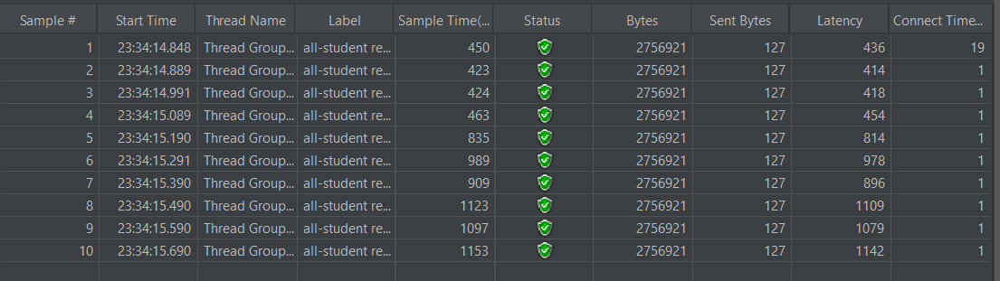
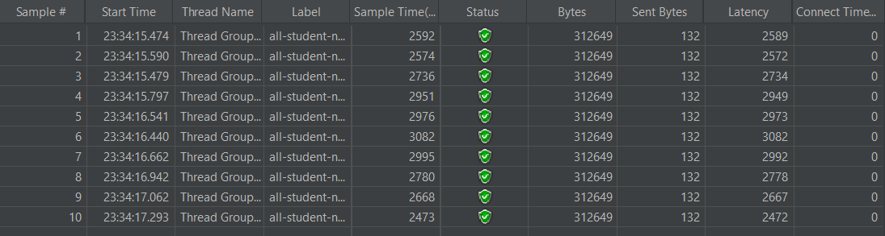
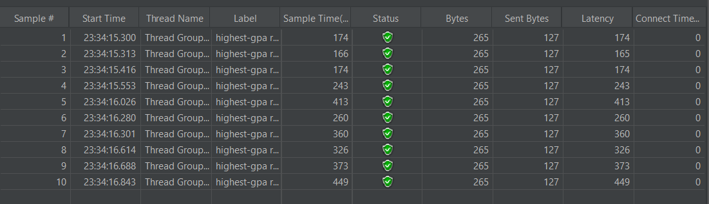
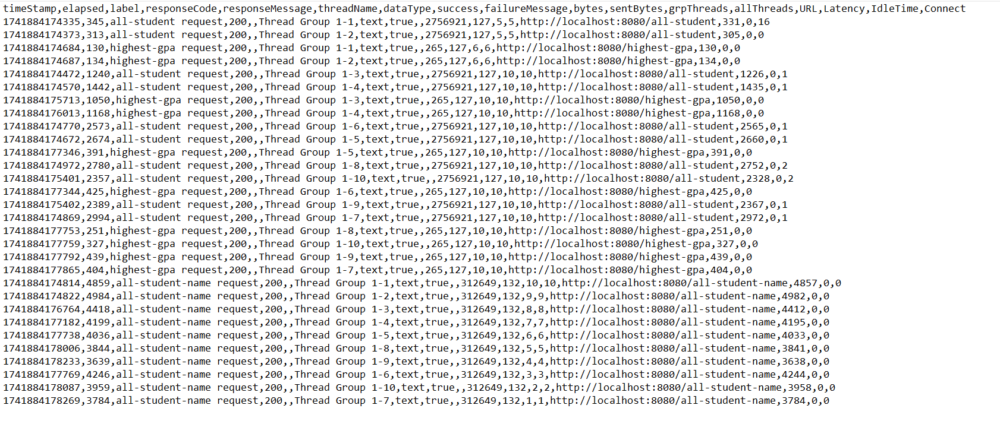

# JMeter before optimization

### all-student

### all-student-name

### highest-gpa

# JMeter after optimization

### all-student

### all-student-name

### highest-gpa

# JMeter using command line

## Explanation

In theory, optimizations are meant to cut down the JMeter sample time. Originally, the method required thousands of milliseconds to execute, and the expectation was that, after optimization, both methods would show a significant reduction in runtime even dropping to single-digit milliseconds. However, contrary to these expectations, the changes I made actually resulted in longer execution times rather than speeding things up.

# Reflection

1. JMeter simulates user load and measures overall system performance while IntelliJ Profiler digs into code-level details and resource usage. JMeter offers high-level metrics like throughput and response times under load, whereas IntelliJ Profiler provides granular insights such as method execution times and memory allocation. Together, they offer complementary views, with JMeter highlighting system-level issues and IntelliJ Profiler pinpointing specific code bottlenecks.

2. Profiling tracks detailed runtime metrics that reveal slow-performing methods and excessive memory consumption. It visualizes execution paths and resource usage, making it easier to pinpoint where most processing time is spent. This focused insight allows you to target specific areas in the code that need optimization.

3. Yes, IntelliJ Profiler is effective because it provides precise insights into the runtime behavior of the application. It highlights performance hotspots, such as inefficient code segments and memory leaks, that directly impact performance. Its integration with the IDE streamlines the analysis process, making it a valuable tool for identifying and resolving bottlenecks.

4. One of the main challenges is accurately simulating real-world conditions while managing the large volumes of data generated during tests. Profiling can introduce its own overhead, which sometimes makes it difficult to distinguish true performance issues from measurement artifacts. I overcome these challenges by refining test scenarios, cross-validating with multiple tools, and continuously adjusting the testing environment to better mirror production conditions.

5. IntelliJ Profiler delivers precise, code-level insights that make it easier to identify inefficient methods and resource-intensive operations. It helps reduce the time spent debugging performance issues by visually highlighting problematic areas in the code. Additionally, its seamless integration within the development environment simplifies the workflow for performance optimization.

6. In such cases, I compare and correlate data from both tools to identify any discrepancies and determine their root causes. I adjust test conditions and may use additional diagnostic tools to validate the findings and ensure a comprehensive understanding. This multi-angle approach helps me reconcile differences and focus on addressing the most critical performance issues.

7. I prioritize optimizations by targeting the most impactful bottlenecks identified through both performance testing and profiling. I implement changes incrementally and leverage unit tests and integration tests to verify that functionality remains intact. Additionally, I re-run performance tests after each change to ensure that the improvements are effective and no new issues are introduced.